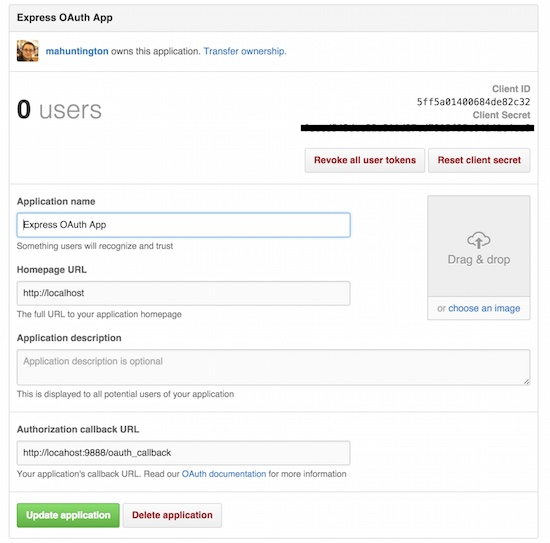

# Example Express OAuth2 App

An exercise for understanding the OAuth2 Web Protocol "flow" using the GitHub
API. Follow the below steps:

1. Sign up for a new application on GitHub.
1. Install the app and set up your environment.
1. Implement the "flow."

### Sign up for a new Application on GitHub

- Register your app 
  [under your GitHub settings](https://github.com/settings/applications/new)
- Fill out the form with the following application info and then click
  "Register application":
    - **Application Name**: `Express OAuth App`
    - **Homepage URL**: `http://localhost`
    - **Authorization callback URL**: `http://localhost:9888/oauth_callback`
- You should see something similar to this:
  
- Take note of the Client ID and Client Secret (for below...)

### Install the App and Set Up Your Environment

1. Fork this app, and clone the forked version to your local environment.
1. Install necessary packages with `npm install`.
1. Run the application (however you run your Express apps).
1. If, when you run your app, you receive the message:

  ```
  Server running on port 9888...
  OAuth ID not in environment!
  OAuth Secret not in environment!
  ```
  ... you will need to add your environmental variables. Using either 
  [dotenv](https://www.npmjs.com/package/dotenv) or by loading them in your
  `.bash_profile` or `.bashrc`, include the Client ID and Client Secret from 
  GitHub as the keys `GITHUB_OAUTH_ID` and `GITHUB_OAUTH_SECRET`.

### Implement the "Flow"

- Following the (below) docs and the OAuth 2 flow diagram, add the necessary 
  code to the stubbed out routes to implement the GitHub Web flow:
  - [GitHub OAuth Docs](https://developer.github.com/v3/oauth/#web-application-flow)
  - [OAuth 2 Flow Diagram](oauth2-flow.jpg)
- If you need help at any time, check out the provided solution! To do this:
  1. Run `git checkout solution`, and then look at the code in Sublime.
    - If you have any changes that might be affected by this, you may have to
      either add them or 
      "[stash](https://git-scm.com/book/no-nb/v1/Git-Tools-Stashing)" them
      before you checkout the `solution` tagged commit.
  1. When you're ready, return to your work by running `git checkout master`.
